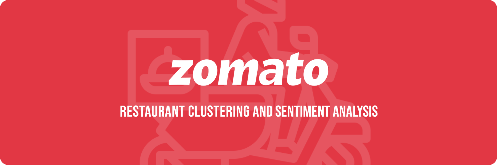
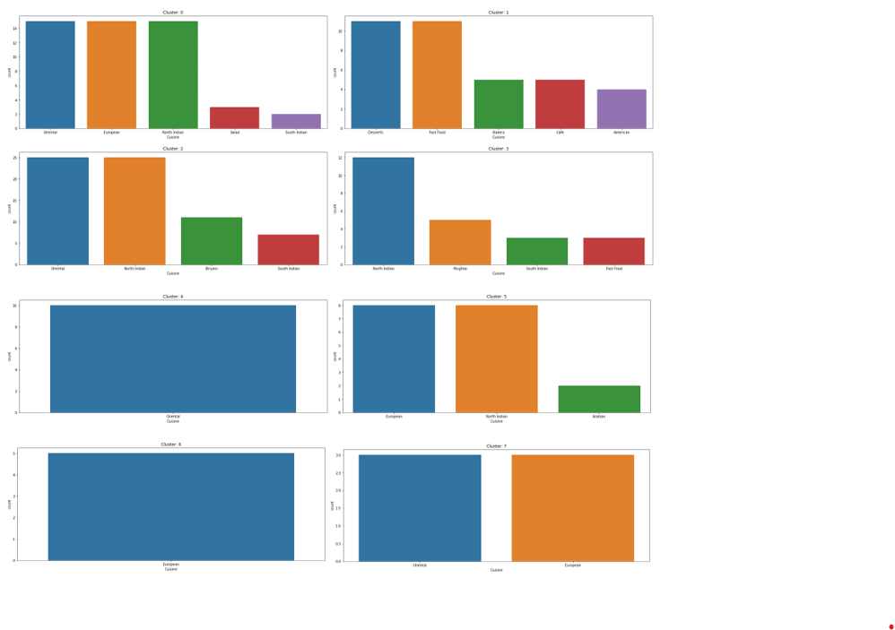
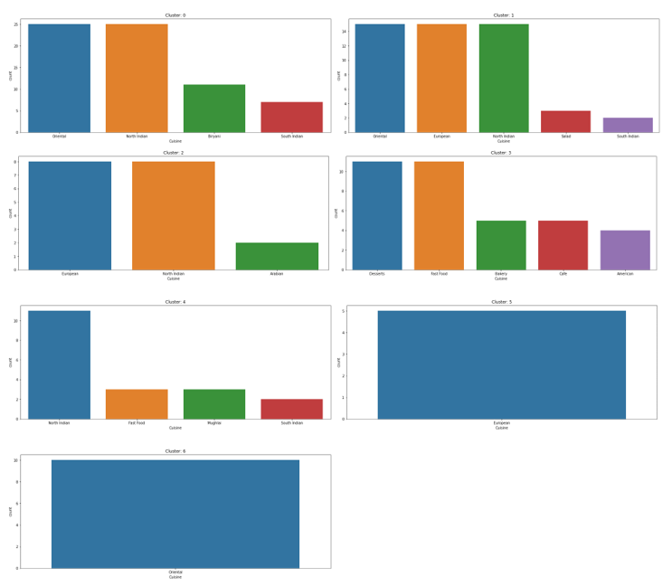
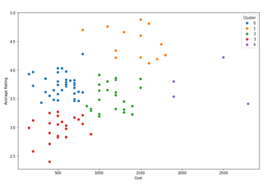
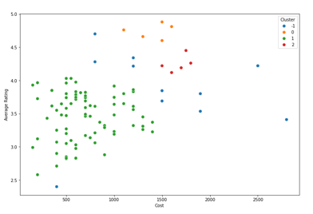

 
  

In this project, I have attempted to analyze the metadata and reviews of popular restaurants in Hyderabad and build machine learning models to cluster the restaurants into different segments based on cuisines and analyze the sentiments of the reviews given by the customers. 

## :floppy_disk: Project Files Description</h2>

This project contains an executable iPython Notebook, a presentation and source as follows:

<h4>Executable Files:</h4>
<ul>
  <li><b>Zomato_Restaurant_Clustering_and_Sentiment_Analysis.ipynb</b> - Google Colab notebook containing data summary, exploration, visualisations, feature engineering, text processing, modelling, performance evaluation and conclusion.</li>
</ul>

<h4>Documentation:</h4>
<ul>
  <li><b>Presentation PDF - Unsupervised Machine Learning - Zomato Restaurant Clustering and Sentiment Analysis - Capstone Project.pdf</b> - Presentation slideshow of the project.</li>
</ul>

<h4>Source Directory:</h4>
<ul>
  <li><b>Data & Resources.zip</b> - Includes metadata and review data of restaurants listed by Zomato in Hyderabad.</li>
</ul>

## :book: Problem Statement

Zomato is an Indian restaurant aggregator and food delivery start-up founded by Deepinder Goyal and Pankaj Chaddah in 2008. Zomato provides information, menus, and user-reviews of restaurants, and also has food delivery options from partner restaurants in select cities.
The main objective is to understand the existing data and analyze their trends and patterns, so that machine learning models can be built, one for segmentation of restaurant types and another for sentiment analysis of reviews.

## :book: Approach

1.	Understanding the business task.
2.	Reading data from files given and providing a summary.
3.	Data cleaning, which involves removing irregularities in the data.
4.	Exploratory data analysis, to find which factors affect sales and how they affect it.
5.	Feature engineering, to prepare data for modelling.
6.	Text Processing, to convert text to numeric data for modelling.
7.	Modelling data (for both clustering and sentiment analysis) and comparing the models to find out the most suitable one for forecasting.
8.	Conclusion.

## :book: Exploratory Data Analysis

The following insights were gained from EDA:
<li>Collage - Hyatt Hyderabad Gachibowli is the most expensive restaurant and Mohammedia Shawarma, and Amul are the most affordable ones.</li>
<li>North Indian cuisine is the most popular cuisine.</li>
<li>Anvesh Chowdary is the most experienced reviewer while Satwinder Singh is the most popular one.</li>
<li>AB's - Absolute Barbecues is the highest rated restaurant.</li>
<li>Some linear relationship exists between the average rating of restaurants and the cost of food.</li>

## :book: Restaurant Clustering Based on Cuisines

## :book: Restaurant Clustering Based on Cost and Rating

## 📘: Conclusion

The following conclusions were drawn from Modelling:
<li>Either of the two models, trained using K means algorithm or DBSCAN algorithm, can be chosen for clustering the restaurant dataset based on cuisines, depending on the number of clusters preferred and whether or not outliers be included.</li>
<li>The model built using K means algorithm is selected for clustering based on cost and ratings.</li>
<li>For sentiment analysis, the model built using random forest algorithm was chosen over others.</li>
<li>If model interpretability is more important than accuracy, model built using logistic regression should be chosen. Since the difference between accuracy of these two models is less than 7%, there won't be much difference in the result.</li>

## :scroll: Credits

Midhun R | Avid Learner | Data Analyst | Data Scientist | Machine Learning Enthusiast

 <i> Contact me for Data Science Project Collaborations</i>

## :books: References
<ul>
  <li>
Scikit Learn, 'sklearn.preprocessing.MultiLabelBinarizer'. [Online].

      
Available: https://scikit-learn.org/stable/modules/generated/sklearn.preprocessing.MultiLabelBinarizer.html/

  </li>
  <li>
Towards Data Science, 'A One-Stop Shop for Principal Component Analysis'. [Online].

      
Available: https://towardsdatascience.com/a-one-stop-shop-for-principal-component-analysis-5582fb7e0a9c/

  </li>
  <li>
Medium, 'Silhouette Analysis in K-means Clustering'. [Online].

      
Available: https://medium.com/@cmukesh8688/silhouette-analysis-in-k-means-clustering-cefa9a7ad111/

  </li>
</ul>
